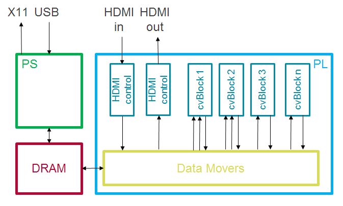

# Pynq - Computer Vision

All Pynq releases ship with the popular [OpenCV](https://opencv.org/) library pre-installed. The Pynq computer vision overlays enable accelerating OpenCV components in Programmable Logic (PL). These overlays expose a subset Xilinx' [xfOpenCV](https://github.com/Xilinx/xfopencv) library (a part of Xilinx' [reVISION solution](https://www.xilinx.com/products/design-tools/embedded-vision-zone.html)) at the Python level, combined with the support for HDMI input/output. Note that webcam, stream or file based input/output remains available through the pre-installed SW OpenCV.  



Currently, two overlays are available for the Pynq-Z1 board:
  + 2D filter & dilate: accelerated 3x3 2D filter and 3x3 dilate. Open the filter2d_and_dilate_example notebook for demo and more details.
  + 2D filter & remap: accelerated 3x3 2D filter and remap. Open the filter2d_and_remap_example notebook for demo and more details. 


## Quick Start

To install the computer vision overlay example on your Pynq board, open a terminal and run:

   ```bash
   $ sudo -H pip3.6 install --upgrade git+https://github.com/Xilinx/PYNQ-ComputerVision.git
   $ sudo reboot now
   ```
   
After the setup, new Jupyter notebooks will be added under the computer_vision folder, ready to try out, no additional steps are needed. 
